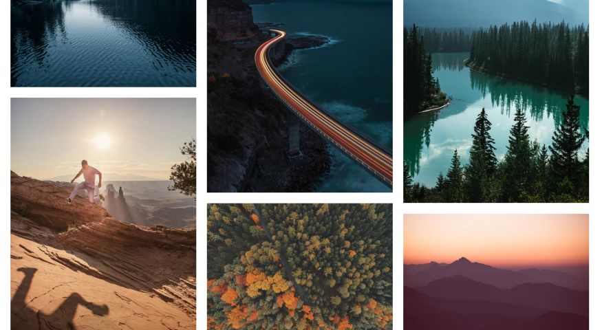
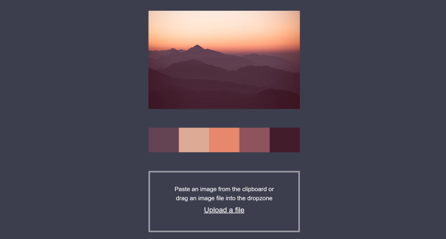

Wie viele Stunden ich wohl schon auf Unsplash oder ähnlichen Seiten verbracht habe, auf der Suche nach Bildern für Projekte, Bildschirmhintergründe oder einfach nur um einen Überblick zu erhalten. Teilweise aber auch einfach aus Genuss, dem Bedürfnis schöne, harmonische Darstellungen zu sehen. Der Fokus hierbei liegt seltenst auf dem Motiv. Besonders begeistern mich außergewöhnliche Blickwinkel oder Botschaften. Der andere Hauptfaktor sind Kontraste, wie sie (fast) nur in der Natur vorkommen und nur sehr gut Fotografen in einfangen können.

Ich bin leider kein so guter Fotograf, tatsächlich bin ich gar keine Fotograf. Das heißt aber nicht, dass ich diese Schönheit nicht erkenne und nutzen möchte.
Während meiner Arbeit als Frontend Entwickler versuche ich regelmäßig Farbpaletten zu erstellen. Wer schon einmal versucht hat zwei oder drei der 16,777,216‬ Farben zu finden die gut zusammenpassen, die gewollte Nachricht vermitteln und dann noch die entsprechenden Kontraste besitzen, weiß das dies keine einfach Aufgabe ist.
Warum also nicht die harmonischen Zusammensetzungen dieser Bilder nutzen und aus diesen Farbpaletten generieren? Da ich selbst nur wenig von der Harmonielehre der Farben verstehe und nicht weis, wie diese in den Bildern zusammenwirken, habe ich zunächst recheriert, ob es bereits Projekte gibt, welche dies können. Hierbei bin ich auf diese großartige Bibliothek [Vibrant.js](https://jariz.github.io/vibrant.js/).

> Vibrant.js is a javascript port of the [awesome Palette class](https://developer.android.com/reference/android/support/v7/graphics/Palette.html) in the Android support library.

Um diese Erkenntnisse im Alltag möglichst effizient nutzen zu können habe ich eine Website geschrieben, in welche man beliebige Bilder kopieren/ziehen/hochladen kann. Daraufhin wird das Bild von Vibrant.js analysiert und eine entsprechende Farbpalette angezeigt.
Vielleicht kann diese Seite ja auch dir helfen eine Inspiration oder sogar ein (fast) fertiges Farbkonzept zu finden. Versuch es einfach mal [https://image-palette.tomeckardt.com](https://image-palette.tomeckardt.com)

